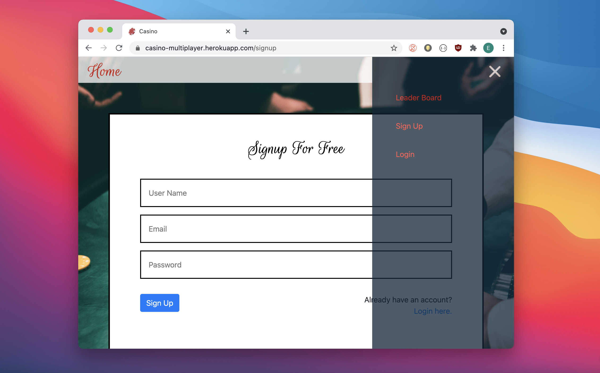
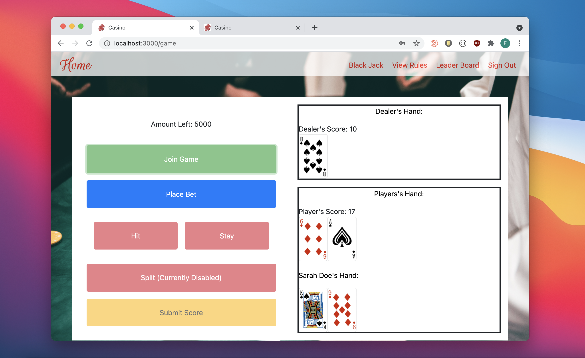

# BlackJack Casino

## Description

Play a multiplayer game of BlackJack against the house with you and your friends! To start, the user must make an account by signing up with their username, email, and password. After signing in, the user will be directed to the game page and will have the option to join. Once the user has joined the game, they will be able to view other players who are currently playing. When the user is finished playing, they will be able to submit their score on the leaderboard.

# Table of Contents

* [Screenshots](#screenshots)

* [Installation](#installation)

* [Heroku Link](#heroku-link)

* [Video Link](#video-link)

* [Built With](#built-with)

* [License](#license)

## Screenshots

## Installation

To install necessary dependencies, run the following command:

''
npm i
''

## Heroku Link

Heroku Link: https://casino-multiplayer.herokuapp.com/

## Built With

* CSS
* JavaScript
* Node.js
* Bootstrap
* React JS
* NPM
    * Node Express
    * Socket.io
    * MongoDB/Mongoose
    * Jsonwebtoken
    * axios
    * bcrypt
    * nodemon

## License

This projects is licensed under the MIT license.

